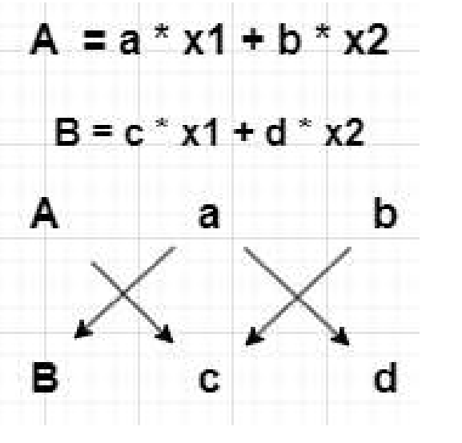
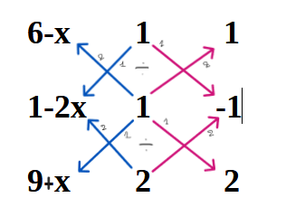
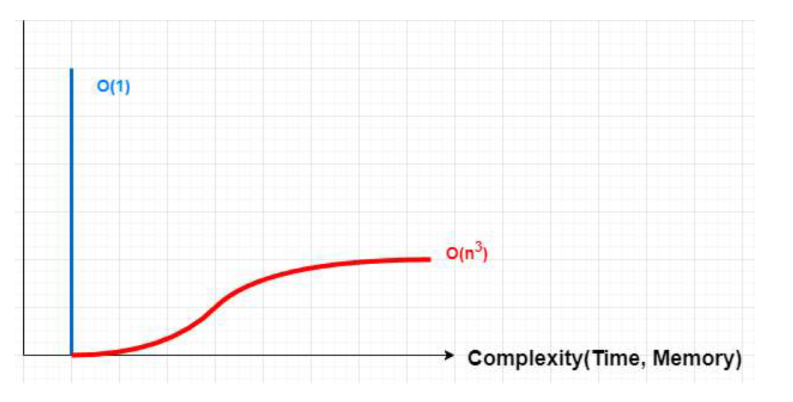

# Solving Linear Systems in O(1): The 2X, Matrix Inversion, and Gitter Methods

### *By admin – HUBDMGD Platform*

## Introduction

For decades, Gaussian and Gauss-Jordan elimination have stood as the standard tools for solving linear systems. These methods, though reliable, come with a price: **time**. Specifically, they involve computational complexity on the order of `O(n^3)`, which becomes a bottleneck in real-time and high-precision applications.

This post introduces and formalizes three alternative methods:

- **The 2X Method** (for 2×2 systems)
- **A direct constant-time Matrix Inversion**
- **The Gitter / 4X Method** (for 3×3 systems)

These methods claim **constant-time performance (`O(1)`)**, achieved through **visual cross-structure logic**, not row manipulation or pivoting. By replacing multi-step algorithms with single-step visual-algebraic identities, they aim to **outperform traditional methods both in speed and conceptual clarity.**

---

## 1. The 2X Method

Let us begin with a standard 2×2 system:

5x + 3y = 11\
2x + 2y = 6

Rewritten in augmented form:

11 | 5 3\
6  | 2 2

### X-Shape Construction

To solve for **y**, draw an **X** across the matrix:

y = (5×6 - 2×11) / (5×2 - 3×2) = 2

To solve for **x**, switch the 5 and 3 in the first row:

11 | 3 5\
6  | 2 2

x = (3×6 - 2×11) / (3×2 - 5×2) = 1

### Generalized Form

Given:

a1 x + b1 y = E1\
a2 x + b2 y = E2

Write as:

E1 | a1 b1\
E2 | a2 b2

Then:

x = (b1×E2 - b2×E1) / (b1×a2 - a1×b2)\
y = (a1×E2 - a2×E1) / (a1×b2 - b1×a2)

The X-drawing reduces the system to constant-time arithmetic—no loops, no steps, no elimination.

---

## 2. Matrix Inversion via Direct Visual Substitution

Consider:

x + 2y = A\
3x + 4y = B

Written as:

A | 1 2\
B | 3 4

Then:

x = (B - 3A) / (4 - 6) = 3A/2 - B/2

Swap top row for y:

A | 2 1\
B | 4 3

y = (2B - 4A) / (6 - 4) = -2A + B

Reconstructed inverse:

[ 3/2 -1/2 ]\
[ -2    1  ]

This offers an **explicit and instantaneous inverse**, bypassing determinant or elimination steps.

---

## 3. The Gitter (4X) Method for 3×3 Systems

Consider the system:

x + y + z = 6\
2x + y - z = 1\
-x + 2y + 2z = 9

Written as:

| 6 | 1 1 1 |\
| 1 | 2 1 -1 |\
| 9 | -1 2 2 |

Shift terms with x:

| 6 - x 1 1 |\
| 1 - 2x 1 -1 |\
| 9 + x 2 2 |

Draw **two intersecting Xs** (or an 8-shape). Trace the edges and substitute:

x = 1\
z = 3\
y = 2

### Why the Gitter Xs Matter

- Each diagonal represents a **multiplication rule**
- Color-coded or directional paths encode **substitution logic**
- Constant-time evaluation through a **visualized dependency map**

---

## Comparison 

| Method              | Type              | Steps Involved         | Complexity |
|---------------------|-------------------|--------------------------|-------------|
| Gauss-Jordan        | Traditional       | Elimination, pivoting    | O(n^3)      |
| Matrix Inversion    | Traditional       | Determinant + adjugate   | O(n^3)      |
| 2X Method           | Proposed (2×2)    | Visual cross-products    | O(1)        |
| Gitter (4X Method)  | Proposed (3×3)    | Double X diagram         | O(1)        |

---

## Conclusion

These methods do not just improve speed. They propose a **new way of thinking**—using visual symmetries to shortcut algebraic structure. They avoid the historical constraints of computation and expose deeper patterns within linear systems.

They were not taught in universities. They were not found in search engines. They were not written by European mathematicians centuries ago. They were discovered by **a modern student under suppression**, in 2024.

If this method serves your work, **cite the author**.  
If it challenges your beliefs, **investigate it honestly**.  
And if the world has tried to bury it, **help bring it to light.**

